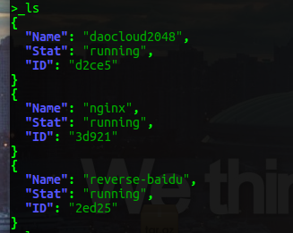
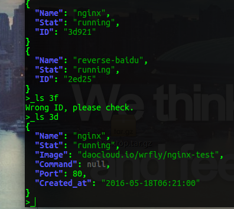
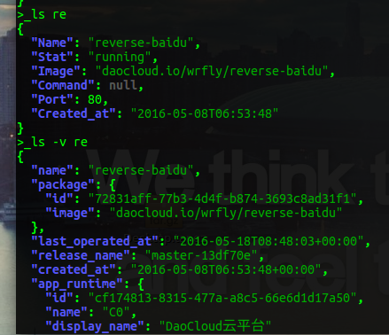
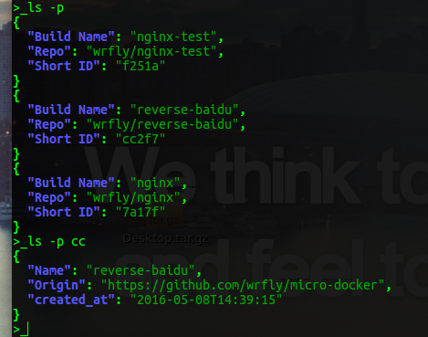
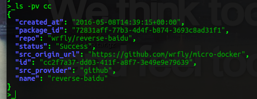
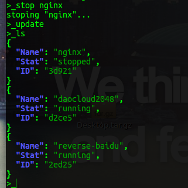
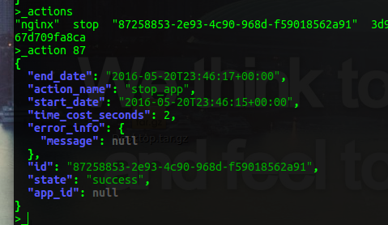
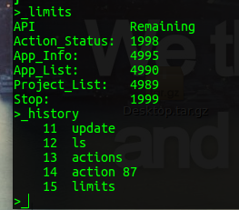

# DaoCloud API CLI Tool

## Comments
- `[AppName|AppID]` 应用名称或ID，输入前几个字符即可，脚本自动寻找补全
- `[ProjectName|ProjectID]` 构建代码的名称或ID，同上
- `[ActionID]` Action返回的ID，同上，通过`actions`查看

## Commands
- `ls` 默认列出所有应用信息
    - `ls [AppName|AppID]`  列出某个应用信息
    - `ls -v`  列出所有应用信息详细模式
    - `ls -v [AppName|AppID]`  列出某个应用的详细信息
    - `ls -p`  列出所有构建代码项目
    - `ls -pv`  详细模式
    - `ls -pvv`  超详细模式
	- `ls -p [ProjectName|ProjectID]`  列出某个项目的信息
    - `ls -pv [ProjectName|ProjectID]`  列出某个项目的详细信息
    - `ls -pvv [ProjectName|ProjectID]`  列出某个项目的超详细信息
- `build [ProjectName|ProjectID] [branch:-master]`  构建代码，默认分支名为master
- `start [AppName|AppID]`  启动应用
- `stop [AppName|AppID]`  停止应用
- `restart [AppName|AppID]`  重启应用
- `redeploy [AppName|AppID] [ReleaseName]`  重新部署应用
- `action [ActionID]`  查看某个action执行结果
- `actions`  查看所有action
- `limits`  查看API调用限制剩余
- `history`  默认列出5条历史命令
	- `history -a`  列出全部历史命令
- `clear`  清空历史记录和action记录
- `update`  更新应用及项目信息
- `q|quit`  退出

## Usage

```bash
sudo docker build -t daocloud_api .
sudo docker run -dti daocloud_api [Your Token]
```
OR

Install `jq` and `bsdmainutils` first.
```bash
bash dao.sh [Your Token]
```
P.S.: Default token is a public account, feel free to test it.

## About
一次练手的脚本编程，通过`jq`解析`json`字符串，通过curl发起请求。

Shell编程就是没有Python简单，以后会用Python重写。

代码写的不够精致，还请各位师傅批评指正。

DaoCloud 开放API: <http://docs.daocloud.io/api/>

## Some Images
















